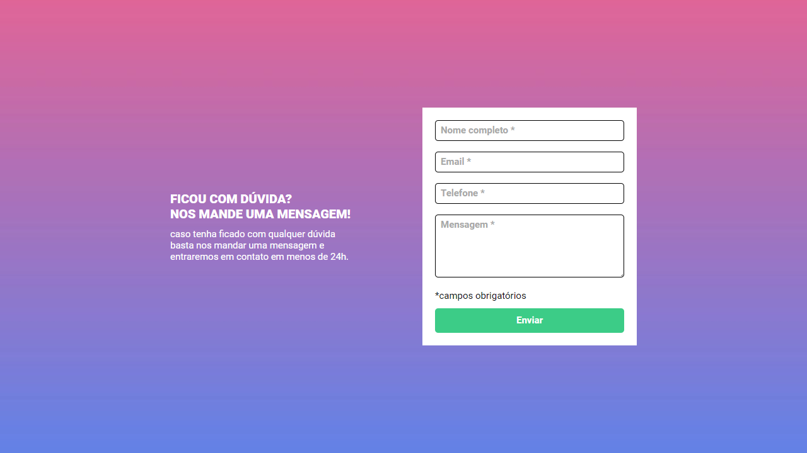
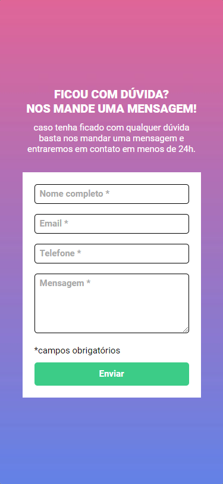
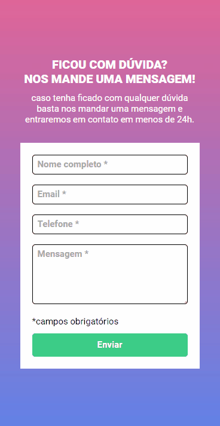

<h1 align="center">
  Formulário com Validação <br/> ⚔️ QUEST HTML + CSS + JS Intermediário
</h1>
<p align="center">
  Projeto de <a href="https://jonathanbenedito.github.io/formulario-com-validacao/" target="_blank">website</a> feito para a uma quest do curso <a href="https://www.linkedin.com/school/devquest-dev-em-dobro/">DevQuest - Dev em Dobro</a>, trata-se de um formulário com validação por javascript.
</p>




## 💬 Sobre

O desafio consistia em validar o formulário, logo após o usuário clicar no botão de "enviar". Caso houver algum campo vazio, é exibido uma mensagem de "campo obrigatório" abaixo do campo e a cor da sua borda ficará em vermelho, do contrário, a mensagem é removida e a cor estará em verde.

## 🛠 Guia de instalação

1. Faça o clone do projeto
    ```
    git clone https://github.com/jonathanBenedito/formulario-com-validacao.git
    ```

2. Acesse o repositório
    ```
    cd formulario-com-validacao
    ```

### 🖼 Fotos (Mobile)

|  |  |
|:---:|:---:|
| Smartphone | Showcase

### 🔗 Links

Website: <a href="https://jonathanbenedito.github.io/formulario-com-validacao/" target="_blank">jonathanbenedito.github.io/formulario-com-validacao</a>

DevQuest - Dev em Dobro (Linkedin): <a href="https://www.linkedin.com/school/devquest-dev-em-dobro/" target="_blank">linkedin.com/school/devquest-dev-em-dobro/</a>

### 🧱 Tecnologias

O website foi construído usando HTML 5, CSS 3 e Javascript.

<div style="display: flex; margin-top: 15px; gap: 20px;">
  
  
          
</div>
